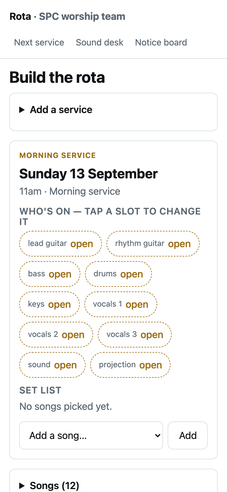

# Rota

Who's on this Sunday. A worship-team app for Springdale Pentecostal Church: every person has their own link (no passwords), marks the days they're away, and sees what they're playing and the set list with keys. The leader builds the rota from people who play the role and aren't away, and a wall page shows the next service for the notice board. The sound desk keeps its channel list and a notes board.

Live: https://rota-app.alexjpower74.workers.dev (public next-service view; personal links are handed out by the leader).



## The rules the code enforces
- A person marked away for a date **cannot** be assigned to a service that day; the leader gets "<name> is away that day."
- Marking yourself away on a day you're already on takes you off that slot and says so.
- Every write carries the row's `rev`; a stale edit gets "Someone changed this just now" and the current row.
- A member's link edits only that member's away days and desk notes; the leader link edits everything; no link at all shows the next service with names only, never phone numbers.

## Results
| Check | Result |
|---|---|
| Worker tests (local D1): auth levels, away rule, stale rev, slot fill and clear, set order, desk notes, phones hidden | **11 of 11**; removing the away check and the rev check each turned exactly one test red |
| App suite, Chromium and WebKit, phone and desktop, real taps hit-tested: away sticks across reload, leader can't pick an away person, fill shows on the member's page and the wall, set order persists, sound notes, public view, plain English, every target hittable | **36 of 36**; with the away handler stubbed out, three went red |
| QA journey and plain-English sweep from the root runner, with built-in negative controls | **12 of 12**. The journey found a real bug: the "Saved" toast sat over the picker on a phone and would have blocked a real tap. Fixed (toast at the top, taps pass through). |
| Import evals against the deployed Worker: every song with its key and BPM, every service with its set in order, 16 channels, then the rules live | **31 of 31** |
| Live round-trip against the deployed Worker with SAMPLE people (cleaned up after): away, refused, filled, member and public views agree, stale rev, cross-member edit refused | **9 of 9** |

Data came from the prototype the team was using (5 services, 12 songs, 16 channels, one real person), imported with fresh personal links.

## Run it yourself
```
cd worker && npm test                      # local D1, migrate, seed, wrangler dev on 6002, API tests
npx playwright test                        # every spec, chromium + webkit, phone + desktop (static server on 6009)
node evals/run.mjs --api <worker> --leader <leader token>
API=<worker> LEADER=<leader token> node tests/live-roundtrip.mjs
```
Contract: `docs/API.md`. How each slice was built and made red once: `docs/build-report-r1..r4.md`. Personal links live in `worker/SECRETS.txt` (never committed).

## Not done yet
- Cut-over from the old prototype link (the old app is still up); the team gets their new links from Alexander.
- Editing a song's key or BPM after it's added; a "lead" singer per set entry (the API supports both, the screens don't yet).
